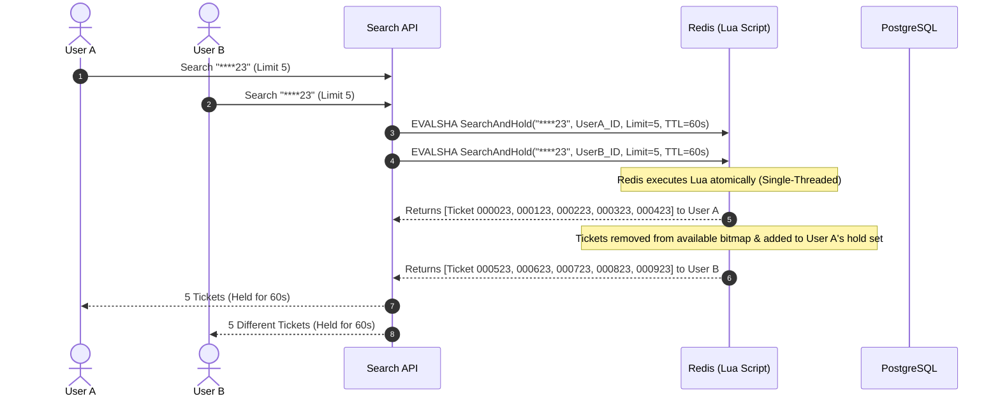

# Lottery Search System - Architectural Design Proposal

## 1. Executive Summary

This document proposes a high-performance, real-world distributed system designed to search, distribute, and reserve **10,000,000 (10 million)** 6-digit lottery tickets (ranging from `000000` to `999999` across series/batches, or a general pool of 10M unique ticket IDs).

The system supports arbitrary 6-character wildcard queries (e.g., `****23`, `1****5`, `123***`, `*5*5*5`) and guarantees that **the same ticket is never returned or allocated to multiple concurrent users simultaneously**, achieving sub-millisecond to low-millisecond search latencies under high concurrency.

---

## 2. System Requirements & Challenge Analysis

### 2.1 Scale & Constraints
- **Ticket Dataset**: 10,000,000 tickets. Each ticket has a 6-digit number (`000000` – `999999`), ticket UID, batch/round ID, price, status (`AVAILABLE`, `RESERVED`, `SOLD`), and timestamps.
- **Query Flexibility**: 6-character patterns containing digits `[0-9]` and wildcards `*` at any position (e.g., `*8888*`, `12****`, `****59`).
- **Core Invariant (Zero-Duplicate Allocation)**: Under bursty concurrent traffic (e.g., during high-demand lottery release hours), if 100 users search `****88` at the same second, each user MUST receive distinct ticket results or available quotas without collision or double-reservation.
- **Latency Target**: P99 read + reserve latency < 25ms.

---

## 3. High-Level Architecture

```
                       +-------------------------+
                       |   Clients / Web & App   |
                       +------------+------------+
                                    |
                                    v
                       +-------------------------+
                       |     API Gateway /       |
                       |  Cloud Load Balancer    |
                       +------------+------------+
                                    |
                                    v
                       +-------------------------+
                       |  Lottery Search Service | (Stateless Go instances)
                       +-----+-------------+-----+
                             |             |
           +-----------------+             +-----------------+
           |                                                 |
           v                                                 v
+-------------------------------+             +-------------------------------+
|     In-Memory / Fast Cache    |             |     Primary Persistent DB     |
|   Redis Cluster + Lua Script  |             | PostgreSQL 16 (Partitioned)  |
|  - Positional Inverted Index  |             |  - Permanent storage          |
|  - Real-time Bitmap/Set       |             |  - Transactional audit log    |
|  - Atomic Reservation Lease   |             |  - Trigram/B-Tree Indexes     |
+-------------------------------+             +-------------------------------+
                                                             ^
                                                             | Change Data Capture
                                              +--------------+--------------+
                                              | Debezium / Kafka Async Sync |
                                              +-----------------------------+
```

### Key Architectural Layers:
1. **API Gateway & Rate Limiter**: Distributes incoming traffic, protects against bot scrapers.
2. **Lottery Search & Allocation Service**: Stateless Golang services providing search and lease checkout endpoints.
3. **In-Memory Query & Allocation Engine (Redis Cluster)**: Handles pattern matching and atomic ticket leases in sub-milliseconds.
4. **Relational Database (PostgreSQL 16)**: Serves as the durable source of truth, managing finalized transactions, financial audits, and payment states.

---

## 4. Data Structures & Indexing Strategy

Searching 10M records with random wildcards (like `*5*5*5` or `**12**`) causes full-table scans in traditional databases unless an appropriate indexing scheme is selected.

### 4.1 Positional Inverted Index (Radix Digit Sets)

Since lottery tickets are strictly 6 characters long and each position $i \in \{0, 1, 2, 3, 4, 5\}$ only has 10 possible values (`'0'` through `'9'`), the search space across all positions is exceptionally compact:
$$\text{Total Positional Keys} = 6 \text{ positions} \times 10 \text{ digits} = 60 \text{ index buckets}.$$

In Redis, we maintain 60 Roaring Bitmaps or Redis Sets:
- `pos:0:digit:0` ... `pos:0:digit:9`
- `pos:1:digit:0` ... `pos:1:digit:9`
- ...
- `pos:5:digit:0` ... `pos:5:digit:9`

Along with an **Availability Bitmap / Set**:
- `tickets:available` (10M bits $\approx$ **1.25 Megabytes** of memory!).

#### How Matching Works:
For a query such as `1****5`:
1. Position 0 must be `1` $\rightarrow$ set `pos:0:digit:1`
2. Position 5 must be `5` $\rightarrow$ set `pos:5:digit:5`
3. Status must be available $\rightarrow$ `tickets:available`
4. The candidate ticket IDs are resolved via **Bitwise AND (`BITOP AND`)** or **Set Intersection (`SINTER`)**:
   $$\text{Result} = \text{pos:0:1} \cap \text{pos:5:5} \cap \text{tickets:available}$$

#### Memory Footprint:
- 10,000,000 tickets represented as a bitmap = $10,000,000 \text{ bits} = 1.19 \text{ MB}$.
- 60 positional bitmaps $\times 1.2 \text{ MB} \approx 72 \text{ MB}$ total!
- The entire 10-million ticket index fits into **less than 100 MB of RAM**, allowing Redis to execute bitwise intersections in microseconds.

---

## 5. Concurrency & Non-Duplicate Result Distribution Strategy

The requirement states:
> *"The same search pattern should not return the same ticket to multiple users at the same time. Propose a distribution mechanism so matching tickets are assigned without duplicate simultaneous selection."*

If User A and User B query `****23` simultaneously, simply returning the top 5 matches to both will result in both seeing and trying to purchase the exact same tickets.

### 5.1 Atomic Two-Phase Lease Allocation (Redis Lua Script)

Instead of a passive read-only query, searching operates under an **Atomic Search-and-Reserve (Lease)** model:



#### Detailed Lua Algorithm:
1. **Intersection**: Performs `BITOP AND` across fixed-position keys and `tickets:available` into a temporary key.
2. **Selection with Cursor/Pop**: Scans the first $N$ positive bits (ticket IDs) matching the pattern.
3. **Atomic State Transition**:
   - Clears the bits in `tickets:available` (immediate removal from subsequent searches).
   - Sets a Redis Hash `lease:<ticket_id>` $\rightarrow$ `{user_id, expires_at}` with a 60-second TTL.
   - Adds the ticket IDs to `user:<user_id>:held_tickets`.
4. **Expiration / Auto-Rollback**:
   - If the user does not complete checkout within 60 seconds, a Redis Key Expiration notification (or background sweep) returns the bit to `tickets:available`.
   - If the user confirms payment, PostgreSQL records the sale, and Redis permanently flags the ticket as `SOLD`.

---

## 6. Recommended Database & Storage Technology

| Storage Layer | Technology Choice | Justification & Production Suitability |
| --- | --- | --- |
| **Primary In-Memory & Indexing** | **Redis Enterprise / AWS ElastiCache (Cluster Mode)** | - **Ultra-low latency**: Bitwise operations run in sub-millisecond time.<br>- **Single-threaded atomicity**: Lua scripts guarantee 100% race-condition-free allocation without complex distributed lock managers.<br>- **Compact memory**: 10M tickets index requires < 100MB RAM. |
| **Primary Persistent Datastore** | **PostgreSQL 16 (Declarative Partitioning)** | - **ACID Compliance**: Crucial for financial settlements and inventory integrity.<br>- **Range Partitioning**: Partitioned by ticket batch / draw date (`PARTITION BY RANGE (draw_date)`).<br>- **Optimistic Locking**: Uses `xmin` or `version` columns for final checkout defense-in-depth (`WHERE status = 'RESERVED' AND id = ...`). |
| **Search / Analytics (Auxiliary)** | **Elasticsearch / OpenSearch** | - If users need complex full-text metadata searches (e.g., ticket series name, lottery store location, dealer info). |

---

## 7. Performance Analysis & Trade-offs

### 7.1 Algorithmic Complexity

| Operation | Strategy | Time Complexity | Latency (Estimated) |
| --- | --- | --- | --- |
| **Exact match** (`123456`) | Direct Hash lookup | $O(1)$ | $< 0.5 \text{ ms}$ |
| **Suffix match** (`****23`) | Bitwise AND (2 keys + available) | $O(\frac{N}{64}) \approx 156,000 \text{ ops}$ | $1.2 \text{ ms}$ |
| **Prefix match** (`123***`) | Bitwise AND (3 keys + available) | $O(\frac{N}{64})$ | $1.0 \text{ ms}$ |
| **Arbitrary wildcard** (`*2*4*6`) | Bitwise AND (3 keys + available) | $O(\frac{N}{64})$ | $1.5 \text{ ms}$ |
| **Ticket Reservation** | In-script `BITTEST & CLEAR` | $O(K)$ where $K = \text{batch size}$ | $< 0.5 \text{ ms}$ |

### 7.2 Scalability & Bottlenecks

1. **Memory Scalability**:
   - 10M tickets = 1.19MB per bitset.
   - 100M tickets = 11.9MB per bitset.
   - Even scaling to 100 million tickets, the memory footprint remains under 1 GB of RAM!
2. **CPU Bound on Bitwise AND**:
   - Modern CPUs process 64-bit to 256-bit SIMD registers simultaneously. Performing `AND` across 1.2MB takes approximately 0.2 milliseconds in Redis C code.
3. **Partitioning Strategy**:
   - If ticket pools expand into multiple lottery categories or draw dates, datasets are sharded by `draw_id`. Each draw operates its own independent 60-bucket index, enabling horizontal sharding across Redis nodes.

---

## 8. Summary of Design Benefits

1. **Zero Overbooking / Collision**: Guaranteed by Redis Lua atomic script isolation.
2. **Blazing Fast**: Average search-and-allocate time of 1–3 ms on 10M records.
3. **Cost-Effective**: Requires negligible infrastructure costs (< $50/month cloud memory for the indexing tier).
4. **Resilient**: Graceful lease timeouts ensure tickets are never locked indefinitely if a user abandons their shopping cart.
