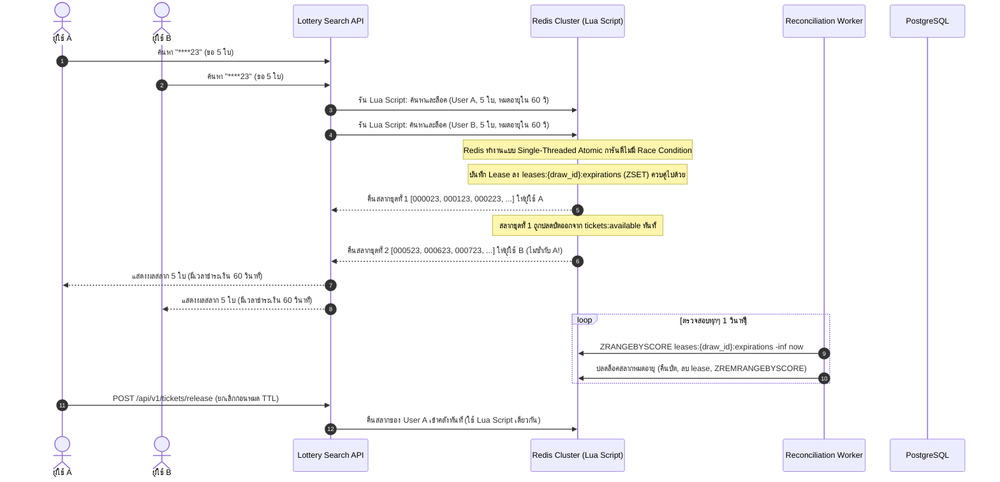

# ข้อเสนอการออกแบบสถาปัตยกรรม: ระบบค้นหาและจัดสรรสลากกินแบ่ง (Lottery Search System)

## 1. บทสรุปผู้บริหาร (Executive Summary)

เอกสารฉบับนี้เป็นข้อเสนอการออกแบบสถาปัตยกรรมระบบแบบกระจาย (Distributed System) ระดับ Production เพื่อรองรับการค้นหา จัดสรร และจองสลากกินแบ่งรัฐบาลจำนวน **10,000,000 ใบ (10 ล้านใบ)** โดยสลากแต่ละใบเป็นเลข 6 หลัก (`000000` ถึง `999999`) 

ระบบรองรับรูปแบบการค้นหาแบบ Wildcard รูปแบบใดก็ได้ใน 6 หลัก (เช่น `****23`, `1****5`, `123***`, `*5*5*5`) พร้อมทั้งมีกลไกรับประกันว่า **"คำค้นหาเดียวกันที่เข้ามาพร้อมกัน จะต้องไม่ส่งคืนเลขใบเดียวกันให้กับผู้ใช้หลายคนในเวลาเดียวกัน" (Zero Double-Allocation / No Simultaneous Duplicate Selection)** โดยทำความเร็วในการค้นหาและจัดสรรสลากได้ในระดับต่ำกว่า 2-5 มิลลิวินาที (Low Latency) ภายใต้ภาระงานสูง (High Concurrency)

---

## 2. ข้อกำหนดและความท้าทายของระบบ (Requirements & Analysis)

### 2.1 ปริมาณข้อมูลและข้อจำกัด (Scale & Constraints)
- **ปริมาณข้อมูลสลาก**: 10,000,000 ใบ ประกอบด้วยข้อมูล เลข 6 หลัก, Ticket UID, รหัสงวด (Draw/Batch ID), ราคา, สถานะ (`AVAILABLE`, `RESERVED`, `SOLD`) และเวลา
- **รูปแบบการค้นหา (Pattern Matching)**: รูปแบบข้อความ 6 ตัวอักษร ประกอบด้วยตัวเลข `[0-9]` และเครื่องหมาย Wildcard `*` ที่ตำแหน่งใดก็ได้
- **เงื่อนไขสำคัญสูงสุด (Concurrency Invariant)**: เมื่อมีผู้ใช้ 100 คน ค้นหาเลขท้าย `****88` เข้ามาพร้อมกันในเสี้ยววินาทีเดียวกัน ระบบจะต้องไม่ส่งสลากใบเดียวกันให้ผู้ใช้หลายคนดูและแย่งกันซื้อ แต่ต้องจัดสรรสลากใบที่ไม่ซ้ำกันให้แก่ผู้ใช้แต่ละคนแบบทันที (Atomic Allocation)
- **เป้าหมายด้านประสิทธิภาพ**: P99 Latency ของการค้นหาและล็อคสลาก (Search + Hold) ต้องน้อยกว่า 25 มิลลิวินาที

---

## 3. สถาปัตยกรรมภาพรวมของระบบ (High-Level Architecture)

```
                       +-------------------------+
                       |   ผู้ใช้งาน (Web / App)    |
                       +------------+------------+
                                    |
                                    v
                       +-------------------------+
                       |     API Gateway /       |
                       |  Cloud Load Balancer    |
                       +------------+------------+
                                    |
                                    v
                       +-------------------------+
                       |  Lottery Search Service | (Go Service แบบ Stateless ขยายโหนดได้อิสระ)
                       +-----+-------------+-----+
                             |             |
           +-----------------+             +-----------------+
           |                                                 |
           v                                                 v
+-------------------------------+             +-------------------------------+
|     In-Memory / Fast Cache    |             |     Primary Persistent DB     |
|   Redis Cluster + Lua Script  |             | PostgreSQL 16 (Partitioned)  |
|  - Positional Inverted Index  |             |  - บันทึกข้อมูลถาวร            |
|  - Real-time Bitmap/Set       |             |  - ระบบชำระเงินและ Audit Log   |
|  - Atomic Reservation Lease   |             |  - ทำงานแบบ ACID Transaction   |
+-------------------------------+             +-------------------------------+
                                                             ^
                                                             | ซิงค์ข้อมูลสถานะแบบ Asynchronous
                                              +--------------+--------------+
                                              | Kafka / Debezium Event Bus  |
                                              +-----------------------------+
```

### หน้าที่ของแต่ละส่วน:
1. **API Gateway & Rate Limiter**: กระจายทราฟฟิก ตรวจสอบความปลอดภัย และป้องกันบอทยิงดึงเลขสลาก
2. **Lottery Search Service (Golang)**: บริการแบบ Stateless ทำหน้าที่รับคำขอ แปลงคำค้นหาเป็น Query ส่งไปยัง Redis
3. **In-Memory Engine (Redis Cluster)**: แกนกลางของระบบค้นหาและจองสลาก โดยเก็บ Positional Bitmap Index และประมวลผลคำสั่งแบบ Atomic ผ่าน Lua Script
4. **Relational Database (PostgreSQL 16 Partitioned)**: ฐานข้อมูลหลักที่เก็บข้อมูลสลากตัวเต็ม บันทึกสถานะการขาย และประวัติการทำธุรกรรมทางการเงินอย่างถูกต้องตามมาตรฐาน ACID

---

## 4. โครงสร้างข้อมูลและกลยุทธ์การทำดัชนี (Data Structures & Indexing Strategy)

การค้นหาข้อมูล 10 ล้านเรคคอร์ดด้วย Wildcard แบบสุ่มตำแหน่ง (เช่น `*2*4*6` หรือ `**88**`) หากใช้ Database ปกติทั่วไปจะต้องทำ Full Table Scan ซึ่งช้ามากและกินทรัพยากรสูง

### 4.1 Positional Inverted Index (Radix Digit Bitmaps)

เนื่องจากสลากกินแบ่งมีความยาวคงที่คือ **6 หลัก** เสมอ และในแต่ละตำแหน่ง $i \in \{0, 1, 2, 3, 4, 5\}$ มีค่าตัวเลขที่เป็นไปได้เพียง 10 ตัวคือ `'0'` ถึง `'9'`

ดังนั้น ขนาดของ Search Space ทั้งหมดจึงมีเพียง:
$$\text{จำนวน Index Buckets ทั้งหมด} = 6 \text{ ตำแหน่ง} \times 10 \text{ ตัวเลข} = 60 \text{ กลุ่มบิตเซ็ต (Bitmaps)}$$

ใน Redis เราจะสร้าง Roaring Bitmap / Bitset ไว้ทั้งหมด 60 ตัว โดยระบุ `draw_id` (งวดสลาก) และครอบด้วย **Hash Tag** `{draw123}` เพื่อให้ Redis Cluster การันตีว่าคีย์ทั้งหมดของงวดเดียวกันจะอยู่บน Slot และ Node เดียวกันเสมอ (จำเป็นสำหรับการใช้ `BITOP` และ `SINTER` ที่ห้ามทำข้าม Node):
- `pos:{draw123}:0:digit:0` ... `pos:{draw123}:0:digit:9` (หลักที่ 1 เป็นเลข 0 ถึง 9)
- `pos:{draw123}:1:digit:0` ... `pos:{draw123}:1:digit:9` (หลักที่ 2 เป็นเลข 0 ถึง 9)
- ...
- `pos:{draw123}:5:digit:0` ... `pos:{draw123}:5:digit:9` (หลักที่ 6 เป็นเลข 0 ถึง 9)

และมี Bitmap พิเศษอีก 1 ตัวสำหรับเก็บสถานะพร้อมขาย:
- `tickets:{draw123}:available` (เก็บบิตสถานะของสลากทั้ง 10 ล้านใบ $\approx$ **1.25 Megabytes** เท่านั้น!)

เนื่องจากทุกคีย์ในงวดเดียวกันใช้ Hash Tag เดียวกัน `{draw123}` ทำให้คำสั่ง Bitwise ระหว่างคีย์สามารถทำงานบน Node เดียวกันได้อย่างสมบูรณ์ ส่วนการ Scale รองรับโหลดมหาศาลจะทำโดยการกระจาย *คนละงวด (Different Draws)* ไปยัง *คนละ Node/Slot* ใน Redis Cluster

#### ตัวอย่างการจับคู่คำค้นหา (Pattern Matching Example):
หากผู้ใช้ค้นหาคำว่า `1****5` ในงวด `draw123`:
1. หลักที่ 0 ต้องเป็น `1` $\rightarrow$ ดึงบิตเซ็ต `pos:{draw123}:0:digit:1`
2. หลักที่ 5 ต้องเป็น `5` $\rightarrow$ ดึงบิตเซ็ต `pos:{draw123}:5:digit:5`
3. ต้องเป็นสลากที่ยังว่างอยู่ $\rightarrow$ ดึงบิตเซ็ต `tickets:{draw123}:available`
4. ทำการหาจุดตัด (Intersection) ด้วยคำสั่งระดับฮาร์ดแวร์ **Bitwise AND (`BITOP AND`)**:
   $$\text{ผลลัพธ์} = \text{pos:0:1} \cap \text{pos:5:5} \cap \text{tickets:available}$$

#### การใช้หน่วยความจำ (RAM Footprint Analysis):
- สลาก 10,000,000 ใบ ใช้ 1 บิตต่อ 1 ใบ = $10,000,000 \text{ bits} = 1.19 \text{ Megabytes (MB)}$ เท่านั้น!
- บิตเซ็ต 60 ตัว $\times 1.2 \text{ MB} \approx 72 \text{ MB}$
- ดัชนีสลากทั้ง 10 ล้านใบ **ใช้ RAM รวมไม่ถึง 100 MB** ทำให้สามารถประมวลผลในระดับ CPU Cache/RAM ของ Redis ได้ในระดับไมโครวินาที (Microseconds)!

---

## 5. กลยุทธ์การป้องกันเลขซ้ำพร้อมกัน (Zero-Duplicate Allocation Strategy)

โจทย์ระบุว่า:
> *"เงื่อนไข: คำค้นหาเดียวกันจะต้องไม่ส่งสลากใบเดียวกันให้ผู้ใช้หลายคนในเวลาเดียวกัน จงเสนอแนวทางจัดสรรสลากโดยไม่เกิดการเลือกซ้ำซ้อนพร้อมกัน"*

หากปล่อยให้ระบบทำเพียงแค่ Read-Only Query ผู้ใช้ A และผู้ใช้ B ที่ค้นหา `****23` พร้อมกัน ก็จะได้เห็นสลากใบเดียวกัน และจะแย่งกันซื้อในขั้นตอนถัดไป

### 5.1 กลไก Atomic Search-and-Hold Lease ผ่าน Redis Lua Script

ระบบจะเปลี่ยนจากการ "ค้นหาเพื่อดู" เป็นการ **"ค้นหาพร้อมล็อคจองสิทธิ์ชั่วคราว" (Atomic Lease Reservation)** ในคำสั่งเดียว:



#### การทำงานภายใน Lua Script:
1. **Bitwise AND**: หา ID ของสลากที่ตรงตามเงื่อนไขและยังมีสถานะว่างอยู่ใน `tickets:{draw_id}:available` ไปยังคีย์ชั่วคราว
2. **การจัดสรรอย่างเป็นธรรม (Fair Selection - Randomized Offset)**: แทนที่จะเลือก $N$ บิตแรกเสมอ (ซึ่งจะทำให้คนที่ค้นหาก่อนได้แต่เลขชุดต่ำๆ เสมอ และเกิด Low-ID Bias) ตัวสคริปต์จะทำการ**สุ่มจุดเริ่มต้น (Random Starting Bit Offset)** ในบิตแมป แล้วกวาดไปข้างหน้าแบบหมุนวน (Wrap-around) ด้วยคำสั่ง `BITPOS` เพื่อรวบรวม $N$ บิตแรกที่พบจากจุดสุ่มนั้น ทำให้ความเร็วคงเดิมที่ $O(N)$ แต่กระจายเลขสลากให้ผู้ใช้อย่างทั่วถึงและเป็นธรรม
3. **Atomic State Transition**:
   - ปลดบิตของสลากที่เลือกออกจาก `tickets:{draw_id}:available` ทันที (คำค้นหาอื่นถัดไปจะไม่มีทางเจอสลากกลุ่มนี้อีก)
   - บันทึกการจอง `lease:<ticket_id>` $\rightarrow$ `{user_id, expires_at}` พร้อมตั้งเวลาหมดอายุ (TTL = 60 วินาที)
   - เพิ่มรายการสลากเข้าไปในตะกร้าชั่วคราวของผู้ใช้ `user:<user_id>:held_tickets`
4. **การปล่อยคืนสต็อกอัตโนมัติ (Expiration / Auto-Rollback ผ่าน Reliable ZSET Reaper)**:
   - การพึ่งพาเพียง **Redis Keyspace Notifications** (`EXPIRE` + Pub/Sub) นั้น **ไม่ปลอดภัยสำหรับระดับ Production**: เนื่องจาก Pub/Sub ของ Redis เป็นการส่งแบบ **at-most-once** หากการเชื่อมต่อหลุด มี Network Blip หรือ Worker กำลัง Restart ในจังหวะที่คีย์หมดอายุ Event "key expired" จะสูญหายไปทันทีโดยไม่มีการส่งซ้ำ ไม่มีคิว และไม่มี ACK ส่งผลให้บิตของสลากไม่ถูกปลดคืน และ**สลากจะค้างอยู่ในสถานะจองตลอดกาล (Stuck Reservation)** ทำให้สต็อกสินค้าค่อยๆ หายไปจากระบบอย่างเงียบๆ
   - ระบบจึงแก้ไขโดยให้ทุกการจองบันทึกข้อมูลเพิ่มลงใน **Redis Sorted Set (ZSET)** ชื่อ `leases:{draw_id}:expirations` โดยมี **Member** คือ `ticket_id` และ **Score** คือ `expiration_unix_timestamp` (ZSET เป็นข้อมูลถาวรใน Redis ไม่ใช่ Event ลอยๆ ข้อมูลจึงไม่สูญหายแม้ Worker จะออฟไลน์)
   - มี **Background Reconciliation Worker** ขนาดเบาคอยดึงข้อมูลจาก ZSET นี้ทุกๆ **1 วินาที**:
     1. `ZRANGEBYSCORE leases:{draw_id}:expirations -inf <now>` เพื่อดึงรายการสลากทั้งหมดที่หมดเวลาแล้ว
     2. รันคำสั่ง Lua Script แบบ Atomic เพื่อปรับบิตกลับเป็น `1` ใน `tickets:{draw_id}:available`, ลบ Hash `lease:<ticket_id>` และลบออกจาก `user:<user_id>:held_tickets`
     3. `ZREMRANGEBYSCORE leases:{draw_id}:expirations -inf <now>` เพื่อล้างรายการที่ปลดล็อคแล้วออกจาก ZSET
   - การโพลล์และสแกนจาก ZSET ซ้ำแบบนี้ ทำให้แม้ Worker จะ Crash, Restart หรือเจอ GC Pause ในรอบถัดไปก็จะหยิบรายการที่ค้างอยู่มาปลดล็อคต่อได้ทันที **การันตีการ Rollback คืนสต็อก 100% โดยไม่มีสลากหลุดหาย (Zero Inventory Leakage)**
   - หากผู้ใช้ชำระเงินสำเร็จก่อนหมดอายุ PostgreSQL จะบันทึกการขาย รายการจะถูกลบออกจาก ZSET ทันที (Reaper จะไม่มายุ่ง) และเซ็ตสถานะใน Redis เป็น `SOLD` อย่างถาวร

#### Explicit Release API (การแก้ปัญหาของค้างสต็อก - Inventory Starvation Mitigation)
การต้องรอจนครบ 60 วินาทีทุกครั้งที่ผู้ใช้ค้นหาดูเล่นๆ แล้วปิดแอปหรือกดยกเลิก เป็นการเสียโอกาสในการขายอย่างมาก เพราะสลากจะถูกกักไว้ 1 นาทีเต็มโดยไม่มีใครซื้อ และผู้ใช้คนอื่นค้นหาก็จะไม่เจอสลากนั้น

ระบบจึงมี Endpoint สำหรับปลดล็อคคืนสต็อกทันที:

```http
POST /api/v1/tickets/release
{
  "user_id": "UserA_ID",
  "ticket_ids": ["000023", "000123", "000223"]
}
```

- เรียกใช้อัตโนมัติจากฝั่ง Client เมื่อผู้ใช้ปิดหน้าผลการค้นหา, กดยกเลิก, หรือเปลี่ยนหน้า (ผ่าน `beforeunload` หรือ Route-change Hook)
- ทำงานผ่าน Lua Script ปลดล็อคตัวเดียวกับ Reconciliation Worker (คืนบิตใน `tickets:{draw_id}:available`, ลบ Hash `lease:<ticket_id>`, ลบออกจาก `user:<user_id>:held_tickets` และลบออกจาก ZSET) ทำให้การคืนสิทธิ์เสร็จสิ้นภายในระดับมิลลิวินาที สลากกลับมาพร้อมขายให้คนอื่นได้ทันที

#### ความคงทนของข้อมูลและการสร้างดัชนีใหม่ (Redis Durability & Cold-Start Rebuild)
ในระบบนี้ Redis ทำหน้าที่เป็น **Derived, Rebuildable Index** (ดัชนีที่สร้างใหม่ได้เสมอ) ไม่ใช่ Source of Truth หลัก โดย PostgreSQL คือ Source of Truth ที่แท้จริง:
- เปิดใช้งาน **Redis AOF Persistence** (`appendfsync everysec`) ควบคู่กับ RDB Snapshot เพื่อให้ข้อมูลส่วนใหญ่รอดพ้นการรีสตาร์ทตามปกติ
- ในกรณี Cold Start (เปิดระบบใหม่ หรือ Redis ว่างเปล่า) จะมี **Bootstrap Job** ที่อ่านข้อมูลจาก PostgreSQL (`SELECT id, number FROM tickets WHERE status = 'AVAILABLE'`) แล้วสร้างบิตแมป 60 ตัวและ `tickets:{draw_id}:available` ขึ้นมาใหม่ทั้งหมด ซึ่งสแกน 10 ล้านเรคคอร์ดเสร็จสิ้นภายในไม่กี่วินาที
- รายการจองชั่วคราว (`lease:<ticket_id>`) จะถูกบันทึกสถานะ `RESERVED` ลงในตาราง PostgreSQL ไว้ด้วย ทำให้สถานะการจองไม่สูญหายแม้ Redis จะดับกะทันหันระหว่างที่ผู้ใช้กำลังกรอกข้อมูลชำระเงิน

---

## 6. การเลือกเทคโนโลยีฐานข้อมูลสำหรับ Production

| เลเยอร์ฐานข้อมูล | เทคโนโลยีที่เลือก | เหตุผลความเหมาะสมในการใช้งานจริง |
| --- | --- | --- |
| **In-Memory & Real-time Index** | **Redis Enterprise / AWS ElastiCache (Sharded per-draw via Hash Tags)** | - **เร็วที่สุดในโลก**: ทำคำสั่งระดับบิต (Bitwise AND) ได้ในระดับ Sub-millisecond<br>- **Atomicity**: การรันผ่าน Lua Script ป้องกัน Race Condition ได้ 100% โดยไม่ต้องใช้ระบบ Distributed Lock ที่ซับซ้อน<br>- **ประหยัดต้นทุน**: ข้อมูล 10 ล้านใบใช้ RAM ต่ำกว่า 100 MB<br>- **Cluster-safe sharding**: คีย์ทั้งหมด 60+1 คีย์ในแต่ละงวดใช้ Hash Tag `{draw_id}` เดียวกัน ทำให้คำสั่ง `BITOP` และ Lua Script ทำงานบนโหนดเดียวกันได้อย่างสมบูรณ์ และสามารถกระจายแต่ละงวดไปยังคนละโหนดเพื่อ Scale แนวนอน |
| **Primary Persistent Storage** | **PostgreSQL 16 (Partitioned Table)** | - **ACID Compliance**: ข้อมูลการเงินและสลากต้องมีความถูกต้องสูง ไม่สูญหาย<br>- **Declarative Partitioning**: แบ่งพาร์ติชันตามงวดสลาก (`PARTITION BY RANGE (draw_date)`) ทำให้ Query ประวัติและงวดเก่าได้อย่างรวดเร็ว<br>- **Optimistic Locking**: ตรวจสอบซ้ำด้วยเงื่อนไข `WHERE status = 'RESERVED' AND id = ...` ในจังหวะตัดเงิน ป้องกันข้อผิดพลาดซ้ำสอง |
| **Search / Analytics (Auxiliary)** | **Elasticsearch / OpenSearch** | - รองรับการค้นหา Metadata ข้อความขั้นสูงในอนาคต (เช่น ค้นหาตามชื่อชุดสลาก, ที่ตั้งแผงสลาก, ข้อมูลตัวแทนจำหน่าย) |

---

## 7. การวิเคราะห์ประสิทธิภาพและความคุ้มค่า (Performance Analysis)

### 7.1 ความซับซ้อนของอัลกอริทึม (Time Complexity)

| รูปแบบการทำงาน | ตัวอย่าง | Time Complexity | ระยะเวลาเฉลี่ยโดยประมาณ |
| --- | --- | --- | --- |
| **ค้นหาตรงตัว (Exact match)** | `123456` | $O(1)$ ผ่าน Hash Key | $< 0.5 \text{ ms}$ |
| **ค้นหาเลขท้าย (Suffix match)** | `****23` | $O(\frac{N}{64})$ จากการ AND 2 บิตเซ็ต | $1.0 - 1.5 \text{ ms}$ |
| **ค้นหาเลขหน้า (Prefix match)** | `123***` | $O(\frac{N}{64})$ จากการ AND 3 บิตเซ็ต | $1.0 \text{ ms}$ |
| **ค้นหาแบบสลับหลัก (Arbitrary wildcard)** | `*5*5*5` | $O(\frac{N}{64})$ จากการ AND 3 บิตเซ็ต | $1.2 - 1.8 \text{ ms}$ |
| **การจองและตัดสต็อก (Lease Hold)** | ดึงและสลับบิต $K$ ตัว | $O(K)$ | $< 0.5 \text{ ms}$ |

*(หมายเหตุ: $N = 10,000,000$ บิต สำหรับ CPU 64-bit จะใช้รอบประมวลผลเพียง 156,250 operations ซึ่งคอมพิวเตอร์สมัยใหม่คำนวณเสร็จในเวลาไม่กี่เศษส่วนของมิลลิวินาที)*

### 7.2 ความสามารถในการขยายระบบ (Scalability)
1. **การขยายขนาดข้อมูล**: หากเพิ่มเป็น 50 ล้าน หรือ 100 ล้านใบ ดัชนีจะใช้ RAM เพิ่มเป็น ~700 MB ซึ่งเครื่อง Server ขนาดเล็กทั่วไปก็ยังสามารถรองรับได้อย่างสบาย
2. **ขีดจำกัด CPU บน Bitwise AND**: CPU สมัยใหม่ประมวลผลคำสั่ง SIMD 64-bit ถึง 256-bit ได้พร้อมกัน การทำ AND บนข้อมูล 1.2 MB ใน C-code ของ Redis ใช้เวลาเพียงประมาณ 0.2 มิลลิวินาที
3. **การขยายรองรับผู้ใช้งาน (Horizontal Scaling)**: ทำ Sharding แยกตาม `draw_id` (งวดที่ออกสลาก) โดยทุกคีย์ในงวดเดียวกันใช้ Hash Tag `{draw_id}` ทำให้กระจายคนละงวดไปอยู่คนละ Node ใน Redis Cluster ได้โดยไม่ต้องรัน `BITOP` ข้ามโหนด
4. **ความคงที่ของเวลาค้นหา (Match-Count Independence)**: เพราะต้นทุนการประมวลผลคือการ Bitwise AND บนขนาดบิตแมปที่คงที่ ทำให้เวลาที่ใช้ในการค้นหาจะ**คงที่อยู่ที่ประมาณ ~1-2 มิลลิวินาทีเสมอ** ไม่ว่าคำค้นหานั้นจะจับคู่เจอสลากเพียง 2 ใบ หรือเจอสลากถึง 200,000 ใบ ซึ่งได้เปรียบกว่าการสแกน Index ในฐานข้อมูลทั่วไปที่เวลาประมวลผลจะวิ่งแปรผันตามจำนวนผลลัพธ์ที่พบ

---

## 8. สรุปจุดเด่นของโซลูชันนี้

1. **ไม่เกิดเลขชนกัน 100% (Zero Collision)**: ใช้การตัดตอนจองสิทธิ์ระดับ Atomic ภายใน Redis Lua Script
2. **ประสิทธิภาพสูงสุด (Extreme Performance)**: ใช้เวลาค้นหาเฉลี่ยเพียง 1–3 มิลลิวินาที แม้จะมีข้อมูลสูงถึง 10 ล้านใบ
3. **ประหยัดค่าเซิร์ฟเวอร์**: โครงสร้างข้อมูล Roaring Bitmap ใช้หน่วยความจำน้อยกว่า 100 MB ไม่ต้องพึ่งพา Server ขนาดใหญ่
4. **ความปลอดภัยทางการเงิน**: บันทึกสัญญาสุดท้ายและการเงินลง PostgreSQL 16 พร้อมระบบ Audit Log ที่ตรวจสอบย้อนหลังได้ทุกรายการ
